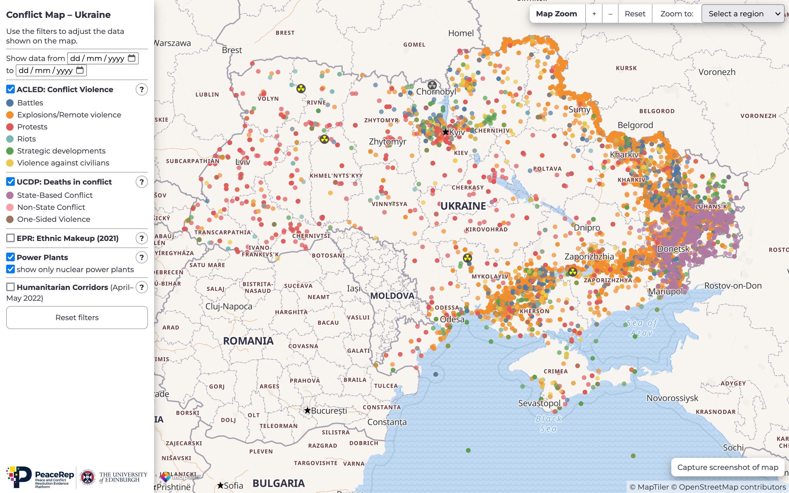

# Conflict Map: Ukraine

## Data Sources

Data sources and updating instructions are documented at [observablehq.com/@sarah37/conflict-map-data](https://observablehq.com/@sarah37/conflict-map-data). Data sources are also included on the map itself, using the `(?)` buttons in the sidebar.

## Libraries

Built using the [MapLibre GL JS](https://github.com/maplibre/maplibre-gl-js) library and [Maptiler](https://www.maptiler.com/) vector tiles. Also using [D3](https://d3js.org/).

## Links

-   [MapLibre GL JS API Reference](https://maplibre.org/maplibre-gl-js-docs/api/)
-   [Using MapLibre GL JS with vector tiles from MapTiler Cloud](https://cloud.maptiler.com/maps/bright/maplibre-gl-js)
